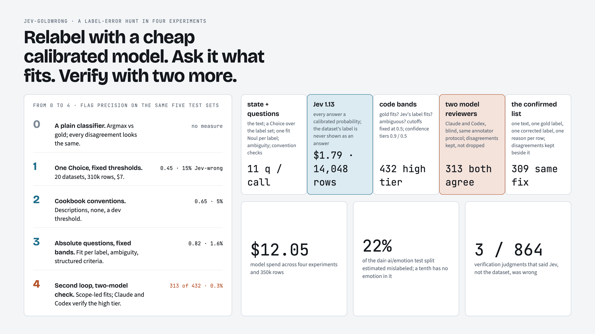
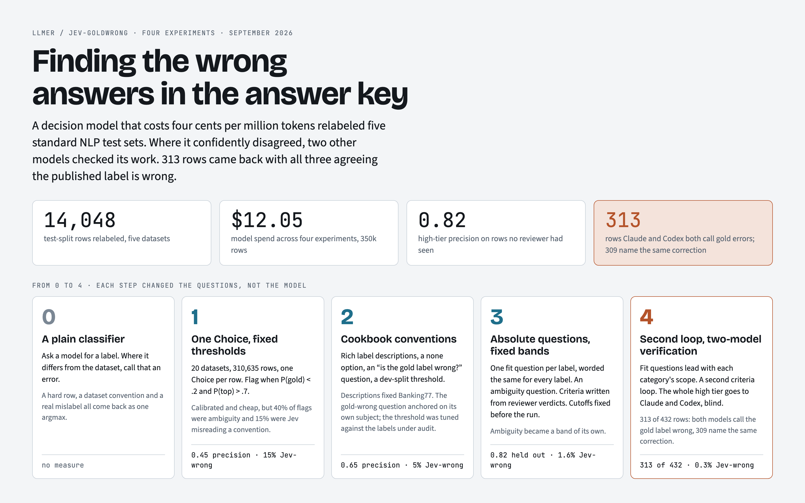
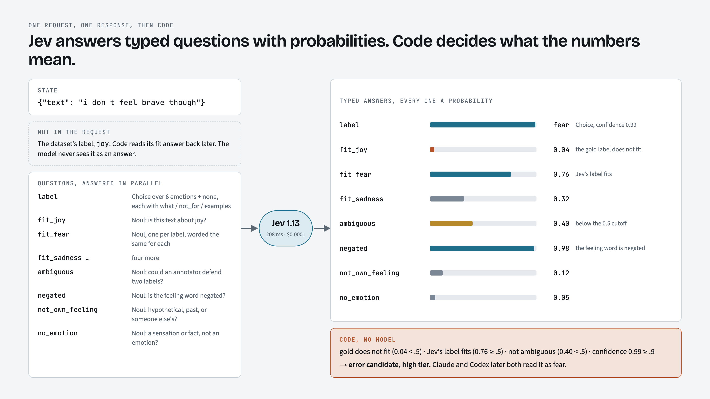
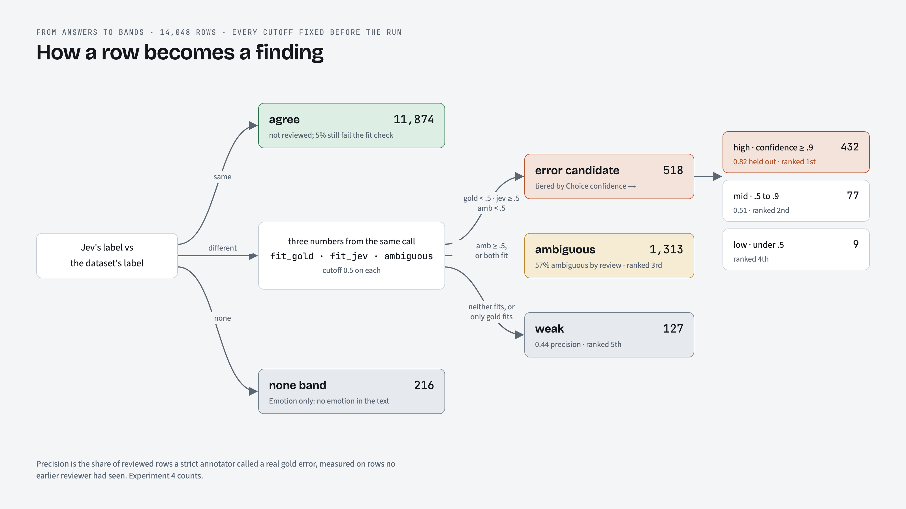
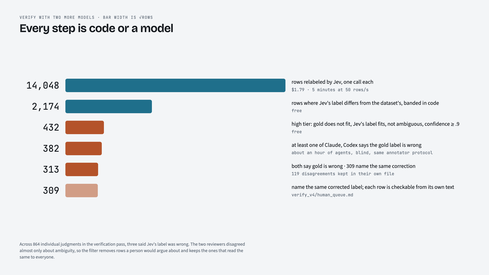
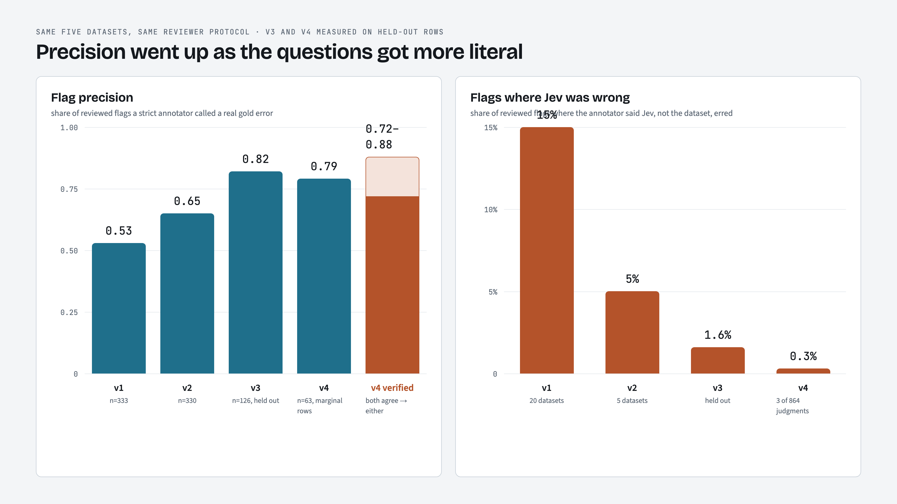
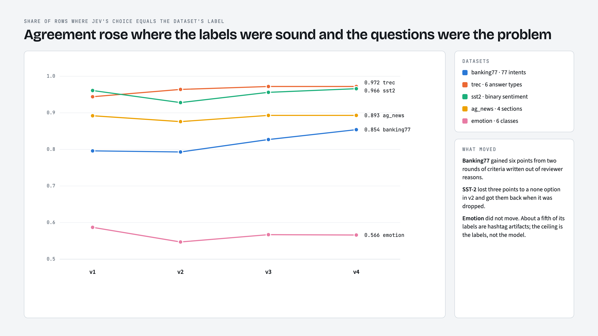
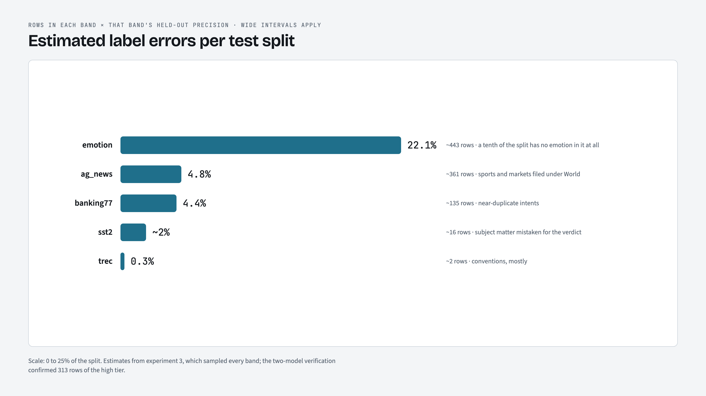
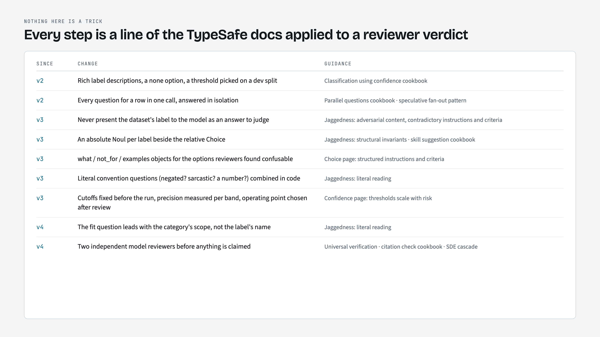

# jev-goldwrong

**Story site:** https://llmer.github.io/jev-goldwrong/ (built from `docs/`, with an Open Graph card for link previews)



Hunting label errors in popular text-classification datasets with [TypeSafe's Jev](https://docs.typesafe.ai/introduction),
a fast, cheap decision model that returns a full probability distribution over labels you define at request time.

Relabel every row with the dataset's own label set. Where Jev confidently disagrees with the gold label, a reviewer
checks the row. The finds are single rows a reader can verify from the text alone, so the claim does not depend on
trusting the model's calibration.

Four experiments so far, about $12.05 of model spend in total:

| | rows | datasets | Jev calls | spend | flags reviewed | flag precision |
|---|--:|--:|--:|--:|--:|--:|
| [Experiment 1](EXPERIMENT-1.md) | 310,635 | 20 | 310,646 | $7.13 | 1,229 | 0.45 |
| [Experiment 2](EXPERIMENT-2.md) | 14,048 | 5 | 14,866 | $1.45 | 330 + 91 | 0.65 |
| [Experiment 3](EXPERIMENT-3.md) | 14,048 | 5 | 14,496 | $1.65 | 339 (held out) | 0.82 (high tier) |
| [Experiment 4](EXPERIMENT-4.md) | 14,048 | 5 | 14,498 | $1.79 | 221 held out + 432 x 2 verifiers | 0.79 held out; 313 of 432 confirmed by both Claude and Codex |

Experiment 1 estimates about 11,000 label errors (3.5% of rows) across 20 datasets. Experiment 2 reworks the pipeline
around the [TypeSafe cookbooks](https://docs.typesafe.ai/cookbooks/classification_using_confidence) (rich option
descriptions, a `none` option, companion yes/no questions in the same call, a dev-split confidence threshold) and
raises flag precision from 0.53 to 0.65 on the same five datasets, with two negative results kept as ablations. Experiment 3 re-reads the docs, replaces the anchored "is the gold label wrong?" question with absolute per-label fit questions plus an explicit ambiguity question, writes structured criteria from the v2 reviewer verdicts, and drops the gold-tuned threshold for fixed bands: the top band reaches 0.82 precision on held-out rows with 1.6% Jev errors. Experiment 4 runs a second criteria loop, rewords the fit questions to lead with each category's scope, and then passes the whole 432-row high tier through two independent model reviewers (Claude and Codex): 313 rows come out with both saying the gold label is wrong and 309 naming the same correction. That list is `verify_v4/human_queue.md`; each row is checkable from its own text.

Headline finds: about 20% of `dair-ai/emotion` is mislabeled (hashtag labels miss negation), 32 of 50 flagged MNLI
pairs are crowd-label errors, DBpedia-14 types a racing yacht as `Building`, AG News files cricket under `World`,
Banking77 labels "Someone stole my cards!" as `lost_or_stolen_phone`. Verified examples with reasons are in each
experiment's report.

## The story in diagrams

Designed artboards live in `docs/canvas/` (one HTML file each); `docs/screenshot.sh` renders them to `docs/diagrams/` with headless Chrome.

















## Layout

```
EXPERIMENT-1.md ... -4.md          write-ups
run_v3.py, datasets_v3.py           v3 runner (per-label fit nouls, ambiguity, conventions) and structured criteria
analyze_v3.py, sample_v3.py,        fixed bands and ranked queue, held-out stratified samples, band precision
report_v3.py                        (VERSION=v4 runs them on the v4 spec and outputs)
datasets_v4.py, chain_v4.sh         v4 overlay: second criteria loop, scope-led fit questions
verify.py                           two-model verification of the high tier: split, then merge into a human queue
run_v2.py, datasets_v2.py           v2 runner (three questions per call) and dataset specs with rich descriptions
analyze_v2.py, report_v2.py         v2 scorecard, bands, noul agreement, v1 comparison
run.py, analyze.py, report.py       v1 runner and analysis (also frozen under v1/)
sample_flags.py                     stratified flag samples for review
chain.sh, chain_v2.sh               detached full runs with a spend cap
out/                                v2 results: summary.json, report_v2.md, flags.jsonl.gz, noul_only.jsonl.gz
review/                             v2 reviewer samples and verdicts (JSONL, one reason per row)
v1/out/, v1/review/                 the same for experiment 1
```

Raw per-row answers (`out/*.jsonl`, hundreds of MB) are not committed; the runners regenerate them and resume from
whatever exists.

## Run it

```bash
cp .env.example .env    # add an OpenRouter key
uv run run_v3.py --dry-run                      # load datasets, print label sets, no API calls
BUDGET_USD=0.10 uv run run_v3.py --limit 10     # 10 rows per dataset
./chain_v3.sh                                   # full run, detached-friendly, $4 cap
python3 analyze_v3.py && python3 sample_v3.py   # bands, queue, held-out review samples
python3 report_v3.py                            # after verdicts land in review_v3/
VERSION=v4 python3 verify.py split              # high tier -> verify_v4/<dataset>.jsonl for two model reviewers
VERSION=v4 python3 verify.py merge              # -> human_queue.md, disagreements.jsonl
```

Requests go to OpenRouter's `POST /api/alpha/decisions` with model `typesafe/jev-1.13` ($0.042 per million input
tokens, output free). Each call carries `state` (the row) and typed `questions`; the answer carries `choice`,
`probabilities`, `confidence`, and `noul` values. Reviews were done by Claude Code subagents acting as strict
annotators with each dataset's guidelines, and the v4 high tier was verified blind by Claude and Codex.
